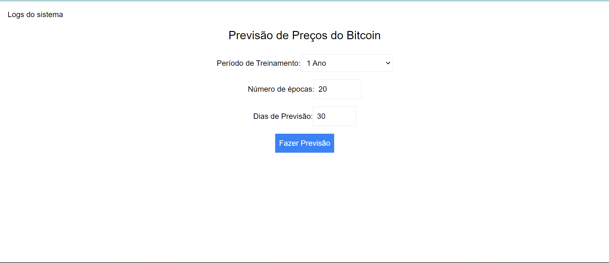
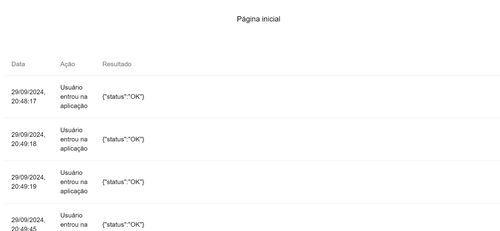

# Frontend da aplicação

O frontend da aplicação foi desenvolvido utilizando o framework Next.js, que é um framework de React que facilita a criação de aplicações web modernas. O Next.js foi escolhido por ser um framework que facilita a criação de aplicações web modernas, com suporte a SSR (Server Side Rendering) e SSG (Static Site Generation), além de ter uma documentação ampla e ser uma ferramenta já utilizada em outros projetos. Os componentes usados foram retirados da biblioteca shadcn UI, que é uma biblioteca de componentes React usadas a partir de outras bibliotecas. Além disso, a estilização foi feita com o tailwindcss, que é uma biblioteca de estilização que facilita a criação de estilos para aplicações web.

## Estrutura do frontend

A estrutura do frontend foi organizada da seguinte forma:

- `src/page.js`: arquivo principal do frontend, onde fica a página inicial da aplicação.
-  `src/app/logs/page.jsx`: arquivo onde fica a página de logs da aplicação.
- `src/app/components/PredictionForm.js`: arquivo onde fica o formulário de predição da aplicação, que pe renderizado na página inicial.

## Páginas do frontend

O frontend possui as seguintes páginas:
- Página inicial: página onde o usuário pode realizar a predição do bitcoin.



Ao selecionar os parâmetros para a predição e clicar em "fazer previsão", um gráfico com o histórico e a previsão do bitcoin é gerado, junto com as métricas do modelo e a recomendação de compra ou venda ou manter.


- Página de logs: página onde o usuário pode visualizar os logs das ações realizadas no site.




## Como rodar o frontend

Caso queira rodar o frontend localmente, é necessário instalar as dependências do projeto. Para isso, siga os seguintes passos:

1. Vá até a pasta do frontend:
```bash
cd src/frontend
```
2. Instale as dependências do projeto:
```bash
npm install
```

3. Rode o frontend:
```bash
npm run dev
```